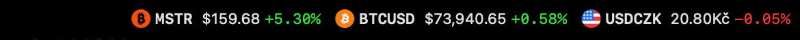
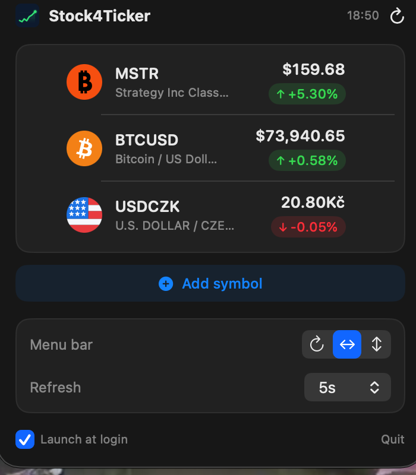

# Stock4Ticker

Native macOS menu bar app for tracking stocks, crypto, forex and futures.
Real-time data from the **TradingView Scanner API** — no login, no API key.



---

## Features

- Menu bar ticker — cycle through symbols, show all side by side, or a 2-row stacked layout
- Symbol logos and currency flags in both the menu bar and the popup (letter-monogram fallback)
- Prices shown in the correct currency — `$`, `€`, `£`, `¥`, `Kč`
- Last prices are cached, so the menu bar shows data instantly on launch, before the first refresh
- Click the ticker to open a popup with details (price, change, % change, volume)
- Click a symbol in the popup → opens its TradingView chart in the browser
- Symbol search via TradingView Symbol Search
- Configurable data refresh interval (5 s – 15 min) and cycle interval (1–8 s)
- Symbols are normalized automatically — just type `AAPL`, `BTC`, `EURUSD`
- Launch at login toggle, right in the popup



---

## Requirements

- macOS 14 (Sonoma) or newer
- Xcode Command Line Tools (`xcode-select --install`)

---

## Installation

```bash
# Build and install
./make-app.sh && cp -R Stock4Ticker.app /Applications/Stock4Ticker.app

# Launch
open /Applications/Stock4Ticker.app
```

To launch automatically at login, tick **Launch at login** at the bottom of the popup.

### Development (without the .app bundle)

```bash
pkill -f Stock4Ticker; swift run
```

---

## Usage

1. Click the ticker in the menu bar → the popup opens
2. **Add symbol** — button at the bottom of the popup, opens search
3. **Manual entry** — format `EXCHANGE:SYMBOL`, e.g. `NASDAQ:AAPL`
4. Drag & drop rows to reorder, click `−` to remove
5. Bottom of the popup — menu bar mode switch, cycle and refresh intervals

---

## Supported markets

| Market | Examples |
|--------|----------|
| US stocks | `NASDAQ:AAPL`, `NYSE:BRK.B`, `AMEX:GLD` |
| EU stocks | `XETR:SAP`, `LSE:SHEL`, `AMS:ASML` |
| Crypto | `BINANCE:BTCUSDT`, `COINBASE:ETHUSD`, `KRAKEN:SOLUSD` |
| Forex | `FX_IDC:EURUSD`, `FX_IDC:USDCZK`, `FX_IDC:GBPJPY` |
| Futures | `CME:ES1!`, `COMEX:GC1!`, `ICEEUR:BRN1!` |
| Indices / dominance | `CRYPTOCAP:BTC.D`, `CRYPTOCAP:TOTAL` |
| India | `NSE:RELIANCE`, `BSE:500325` |
| Asia / Pacific | `ASX:BHP`, `HKEX:700`, `TSE:7203` |

### Automatic normalization

Bare symbols (without `EXCHANGE:`) are converted automatically:

| Input | Result |
|-------|--------|
| `AAPL` | `AAPL` (america scanner) |
| `BTCUSDT` | `BINANCE:BTCUSDT` |
| `BTCUSD` | `COINBASE:BTCUSD` |
| `BTC` | `BINANCE:BTCUSDT` |
| `EURUSD` | `FX_IDC:EURUSD` |
| `USDCZK` | `FX_IDC:USDCZK` |

---

## Architecture

```
Sources/Stock4Ticker/
├── Stock4TickerApp.swift         @main + AppDelegate (NSStatusItem, NSPopover, Combine)
├── StockStore.swift              @MainActor ObservableObject — state, UserDefaults, refresh
├── TradingViewService.swift      Scanner API + Symbol Search API + symbol normalization
├── Models.swift                  Stock, SymbolSearchResult, formatting helpers
└── Views/
    ├── PopoverContentView.swift  Popup + StockRowView + SymbolSearchSheet
    └── LogoView.swift            Shared async logo loader/cache + monogram fallback
```

Menu bar rendering goes through `NSStatusItem.button.attributedTitle` (NSAttributedString),
not SwiftUI — a `MenuBarExtra` label does not receive `@EnvironmentObject` updates.

### Settings (UserDefaults)

Suite: `cz.stock4ticker.app` — consistent between `swift run` and the `.app` bundle.

| Key | Type | Default |
|-----|------|---------|
| `tv_symbols` | JSON `[String]` | `["COINBASE:BTCUSD"]` |
| `tv_refreshInterval` | Double (seconds) | `30` |
| `tv_cycleInterval` | Double (seconds) | `3` |
| `tv_showInMenuBar` | String | `"cycling"` |
| `tv_cachedQuotes` | JSON `[Stock]` | — (last fetched prices) |

Launch at login is **not** stored here — it reflects the real `SMAppService.mainApp` registration.

### Debug log

```bash
tail -f /tmp/stock4ticker.log
```
